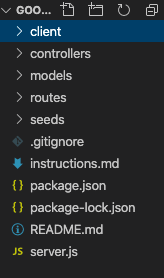

# Google-Book-Search
In this class activity, you'll create a new React-based Google Books Search app. This assignment requires you to create React components, work with helper/util functions, and utilize React lifecycle methods to query and display books based on user searches. You'll also use Node, Express and MongoDB so that users can save books to review or purchase later.

## Table of Contents
  * [Description](#Description)
  * [TableOfContents](#TableOfContents)
  * [Installation](#Installation)
  * [Visuals](Visuals)
  * [Tools](#Tools)
  * [License](#license)
  * [Contributors](#Contributors)
  * [Deployed-Link](#Deployed-Link)
 

## Installation 
* npx create-react-app (folder-name) 

it will generate your models and structure folders

Once you are done with your code, go to the folder's directory and run the following code 
* npm start

## Visuals

## Tools
* React 
* HTML
* CSS
* Bootstrap
* Node.js

## License
MIT License
  
## Contributors
  * [Biencarlo Villa](https://github.com/biencarlovilla)
  * [Leslie Villatoro](https://github.com/leslievill)
  * [Ken Tanoue](https://github.com/kent28808)
   
## Deployed-Link
  [Live Demo](https://team8googlesearch.herokuapp.com/)